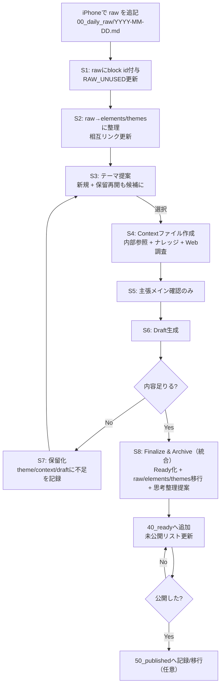

## 1) まず採用する「Obsidian相互参照の書き方」標準

この運用のキモは **“raw（1行メモ）をブロックとして固定し、後工程はリンク/埋め込みで参照する”** ことです。

### 内部リンク（ノート/見出し）

- ノートへ：`[[ノート名]]`
- 見出しへ：`[[ノート名#見出し]]`

### ブロック参照（rawの1行を「追跡可能」にする）

- ブロックリンク：`[[ファイル名#^blockid]]`
- ブロック埋め込み（トランスクルード）：`![[ファイル名#^blockid]]`

### 手動ブロックID（最重要）

- ブロックの末尾に `^id` を付ける（例：`^raw-20260111-001`）
- **スペースを1つ以上空けて** `^id` を書く
- **許可文字は英数字とダッシュ**（`raw-20260111-001` 形式が安全）

> つまり、iPhoneで「1行＝1メモ」で書けば、後でAIが ^raw-... を付けて、記事や要素から精密に参照できます。
> 

---

## 2) Vault（Obsidian保管庫）の推奨フォルダ/ファイル構成

「移動でリンクが壊れる」事故を避けるため、**テーマ/要素は“ファイル移動しない（statusで管理）”** を基本にします。

unused/used は **“一覧ファイル”** をAIが更新して保ちます（ユーザーは触らない）。

```
<Your Obsidian Vault>/
  00_daily_raw/                       # iPhoneで追記するだけ（raw）
    2026-01-11.md                     # 日次raw（1日1ファイル推奨）
    RAW_UNUSED.md                     # 未使用rawブロック参照の一覧（AIが更新）
    RAW_USED.md                       # 使用済rawブロック参照の一覧（AIが更新）

  10_structured/                      # 整理された材料
    themes/                           # 記事テーマ候補（1テーマ=1ノート）
      theme-20260111-001.md
    elements/                         # 記事構成要素（1要素=1ノート）
      elem-20260111-001.md

    THEMES_UNUSED.md                  # 未使用テーマ一覧（AIが更新）
    THEMES_ON_HOLD.md                 # 保留テーマ一覧（AIが更新）
    THEMES_USED.md                    # 使用済テーマ一覧（AIが更新）

    ELEMENTS_UNUSED.md                # 未使用要素一覧（AIが更新）
    ELEMENTS_ON_HOLD.md               # 保留要素一覧（必要なら）
    ELEMENTS_USED.md                  # 使用済要素一覧（AIが更新）

  20_context/                         # S4で作る「方向性＋参照＋ナレッジ＋調査」ファイル
    ctx-2026-01-11-theme-20260111-001.md

  30_drafts/                          # ドラフト
    2026-01-11_decision-principles.md

  40_ready/                           # 完成（未公開）リスト
    2026-01-11_decision-principles.md
    READY_INDEX.md

  50_published/                       # 公開済み（任意）
    2026-01-11_decision-principles.md

  60_thinking/                        # 思考の整理（ジャンル別）
    leadership.md
    strategy.md
    management.md
    THINKING_INDEX.md

  70_knowledge/                       # Deep researchの知識箱（ユーザーが貼る）
    decision-principles.md
    KNOWLEDGE_INDEX.md

  90_templates/                       # Claude Codeが参照してファイル生成
    daily_raw.md
    theme.md
    element.md
    context.md
    draft.md
    thinking.md
    knowledge.md

  99_logs/
    blog_os_log.md
    processed_raw_ids.md              # 「整理済raw」を記録（raw本文は改変しないため）

  CLAUDE.md                           # Claude Code起動時に読み込む指示（推奨）
  .claude/
    commands/                         # /blog-morning など
    skills/                           # S1〜S10のSkill
    rules/                            # 書き方/運用ルール（モジュール化）
    settings.json                     # 権限など

```

Claude Code のメモリ（`CLAUDE.md`）と `.claude/rules/` のモジュールルールは、起動時に読み込まれるプロジェクト指示として設計できます。

---

## 3) ノートのスキーマ（テンプレ）設計

### 3.1 Daily Raw（00_daily_raw/YYYY-MM-DD.md）

運用を成立させるためのルールはこれだけです：

- **1行＝1メモ（箇条書き）**
- AIが後で `^raw-YYYYMMDD-###` を付与（内容は書き換えない）
- rawの「未使用/使用済み」は **RAW_UNUSED/RAW_USED で管理**

テンプレ案（`90_templates/daily_raw.md`）：

```markdown
---
type: daily_raw
date: {{YYYY-MM-DD}}
---

# Daily Inbox (Raw) - {{YYYY-MM-DD}}

## Captures (1 line per item)
-

```

### 3.2 Element（構成要素）ノート

`10_structured/elements/elem-YYYYMMDD-###.md`

```markdown
---
id: elem-20260111-001
type: element
status: unused  # unused | on_hold | used
created: 2026-01-11
updated: 2026-01-11
---

# Element: （短い名前）

## 1行要約
（記事の一部にできる“部品”としての要約）

## 中身（箇条書きでOK）
-

## Source (raw)
- ![[00_daily_raw/2026-01-11#^raw-20260111-001]]

## Related themes
- [[10_structured/themes/theme-20260111-001]]

## Used in articles
- （完成したらここにリンクが入る）

```

### 3.3 Theme（記事テーマ候補）ノート

`10_structured/themes/theme-YYYYMMDD-###.md`

```markdown
---
id: theme-20260111-001
type: theme
status: unused   # unused | on_hold | used
created: 2026-01-11
updated: 2026-01-11
---

# Theme: （記事テーマタイトル案）

## 狙い（読者に何を持ち帰らせるか）
-

## 関連要素（記事パーツ候補）
- [[10_structured/elements/elem-20260111-001]]
- [[10_structured/elements/elem-20260111-002]]

## On-hold gaps（保留理由/不足）
- （保留のときだけ）
- 足りない材料:
  - 具体例が1つ足りない
  - 反対意見への一言が必要

## Source (raw)
- ![[00_daily_raw/2026-01-11#^raw-20260111-003]]

## Articles
- （完成したら ready/published へリンク）

```

### 3.4 Context（S4で必ず作る、方向性＋参照＋ナレッジ＋調査ファイル）

`20_context/ctx-YYYY-MM-DD-theme-...md`

```markdown
---
type: article_context
date: 2026-01-11
theme_id: theme-20260111-001
status: context_ready # context_ready | on_hold | done
---

# Context: Theme theme-20260111-001

## 方向性（angle）
- 主張の方向性:
- 伝えたい読後感:

## 参照（Vault内部）
### Theme
- [[10_structured/themes/theme-20260111-001]]

### Elements
- [[10_structured/elements/elem-20260111-001]]
- [[10_structured/elements/elem-20260111-002]]

### Raw blocks（必要なら）
- ![[00_daily_raw/2026-01-11#^raw-20260111-001]]

### Knowledge (deep research)
- [[70_knowledge/decision-principles]]

## Web research（S4でWebSearch/WebFetch）
- Source A:
  - 要点:
  - URL:
- Source B:
  - 要点:
  - URL:

## 足りないもの（draft前に埋める or 保留判断）
-

```

Claude Code には WebSearch / WebFetch があり、ドメインフィルタ付きWeb検索もできます。

### 3.5 Draft / Ready（ドラフトと完成）

`30_drafts/` と `40_ready/` は内容はほぼ同じテンプレでOK。

違いは frontmatter の `status` と、Ready では “公開手前の整形” が済んでいること。

---

### 3.6 Knowledge（Deep researchの保存箱）

`70_knowledge/<title>.md`（日付ファイル名に固定しない）

```markdown
---
id: knowledge-20260111-001
type: knowledge
created: 2026-01-11
updated: 2026-01-11
source: deep_research
---

# Decision principles

## Summary
-

## Key points
-

## Sources / Evidence
- URL:
- Note:

## Raw paste
- （ユーザーが貼り付ける）

```

- Deep researchの結果はユーザーが貼り付ける。AIは内容を書き換えず、参照リンクとして使う。
- ファイル名はナレッジのタイトルと一致させる（例: decision-principles.md）。
- idはタイトルと一致させず、安定したユニークIDを使う（例: knowledge-YYYYMMDD-###）。
- ユーザーがRaw pasteを貼ったら `/knowledge-process <path>` を実行し、Summary/Key points とファイル名（titleベース）を自動生成する。
- `70_knowledge/KNOWLEDGE_INDEX.md` はAIが更新する（ユーザーは触らない）。
- 参照はファイル名ベースで行う（例: `[[70_knowledge/decision-principles]]`）。
- S4では関連するナレッジを読み、contextにリンクとして残す。

---

## 4) 全体フロー（止まる/再開を含む）

### 4.1 フロー図（Mermaid）



ユーザー起点の場合は `/blog-start <topic>` で S1/S2 → S10 → S4 → S5 → S6 を実行する。

### 4.2 ステート管理（テーマ/要素/raw）

- rawブロック：`RAW_UNUSED` ↔ `RAW_USED`
- elements：`unused → used`（必要なら `on_hold`）
- themes：`unused → on_hold ↔ unused`、または `unused/on_hold → used`

---

## 5) 各ステップで「人間がやること / AIがやること / 触るファイル」

### S0: Capture（随時）

**あなた**

- iPhoneで `00_daily_raw/YYYY-MM-DD.md` に1行ずつ追記（気づいた瞬間）

**AI**

- 何もしない

**触るファイル**

- `00_daily_raw/YYYY-MM-DD.md`

---

### K1: ProcessKnowledge（deep researchの整理）

**あなた**

- `70_knowledge/` にファイルを作成し、Raw pasteにそのまま貼り付ける
- `/knowledge-process <path>` を実行

**AI**

- Raw pasteからタイトルを抽出し、Summary/Key points を自動生成
- ファイル名をタイトルベースにリネーム（英数字/ハイフン主体の安全なslug）
- frontmatter の updated を更新し、idは維持/付与
- `70_knowledge/KNOWLEDGE_INDEX.md` を更新
- Raw paste本文は改変しない

**触るファイル**

- `70_knowledge/*.md`
- `70_knowledge/KNOWLEDGE_INDEX.md`

---

### U1: StartFromTopic（ユーザー起点の記事化）

**あなた**

- `/blog-start <topic>` を実行（必要なら日付を答える）

**AI**

- S1/S2 で当日の raw を処理
- topic からテーマを新規作成または既存テーマを選択（S10）
- S4〜S6 を実行し、contextとdraftを生成

**触るファイル**

- `00_daily_raw/YYYY-MM-DD.md`
- `10_structured/themes/*.md`
- `10_structured/elements/*.md`
- `20_context/*.md`
- `30_drafts/*.md`
- `10_structured/* index files`
- `99_logs/processed_raw_ids.md`

---

### S1: IngestDailyRaw（rawを追跡可能にする）

**あなた**

- 朝、Claude Code で `/blog-morning` を実行（必要なら日付を聞かれたら答える）

**AI**

- その日の raw ノートを読み、各行に `^raw-YYYYMMDD-###` を付与（内容は改変しない）
- もし翌日分の raw ファイル（`00_daily_raw/YYYY-MM-DD.md`）が無ければ、`90_templates/daily_raw.md` から作成する
- 新規rawブロックを `RAW_UNUSED.md` に **埋め込みリンク**として追記
- すでに `RAW_USED.md` にあるものは触らない

**触るファイル**

- `00_daily_raw/YYYY-MM-DD.md`
- `00_daily_raw/RAW_UNUSED.md`
- `00_daily_raw/RAW_USED.md`

（ブロックIDと埋め込みの仕様は Obsidian公式に合わせます。）

---

### S2: DistillRawToElementsAndThemes（整理：要素/テーマ化＋相互参照更新）

**あなた**

- 基本は見てるだけ（必要なら分類がズレた箇所だけ指摘）

**AI**

- `processed_raw_ids.md` を参照し、未処理rawだけを対象に
- elementノートを作成（`elem-...`）
- themeノートを作成/更新（`theme-...`）
- theme⇄element の相互リンクを必ず更新
- 一覧ファイル（THEMES_UNUSED / ELEMENTS_UNUSED etc）を更新
- 処理済raw ID を `processed_raw_ids.md` に記録（raw本文は極力触らない）

---

### S3: ProposeArticle（保留再開も含めて提案）

**あなた**

- AIが出した選択肢から番号で選ぶ

**AI**

- 未使用テーマ候補＋保留テーマを読み、以下を混ぜて提案：
    1. **新規テーマ**：直近のelementsが厚いもの
    2. **保留再開**：保留テーマの “不足（gaps）” を最近のelementsが埋められるもの
- Claude Code の **AskUserQuestion（選択肢質問）** を使って選ばせる
    - userからテーマの指定があった場合はそのテーマについて書く

---

### S4: BuildContext（方向性＋内部参照＋Web調査＝ファイル化）

**あなた**

- 方向性に違和感があればコメント

**AI**

- Contextファイル（`20_context/ctx-...md`）を必ず作成
- 内部参照（theme/element/raw）を埋め込み/リンクで貼る
- 70_knowledge/ のナレッジ（deep research）を参照し、関連するものをリンクで記録
- WebSearch/WebFetch で外部根拠を2〜5件収集して要約を格納

---

### S5: ConfirmMainClaim（意図確認＝主張だけ）

**あなた**

- 「主張AでOK / 主張Bにする / 主張をこう直したい」を答える

**AI**

- トーン・想定読者・文体は **固定**（ルールに書いてあるので毎回聞かない）
- 確認するのは “記事のメイン主張” と “読後に残す一言” だけ（多くても2〜4問）

---

### S6: WriteDraft（ドラフト作成）

**あなた**

- Obsidianでざっと読み、気になる箇所だけメモ（修正はあなたが手でやってもOK）

**AI**

- `30_drafts/` にドラフトを生成
- 内部参照と必要なraw埋め込みを残し、あとから出典追跡できるようにする
- context内のナレッジ参照は References に残す

---

### S7: Hold（足りない場合は保留化）

**あなた**

- 「保留でOK」と言う（またはAIが提案）

**AI**

- theme/context/draft に不足理由と “集めるべき材料” を明記
- `THEMES_ON_HOLD.md` を更新
- 次回以降、S3で再開候補に入るようにする

---

### S8: Finalize & Archive（S8/9/10を統合して“必ず同時に行う”）

ここを **一括処理**にします（あなたが個別に指示しない）。

スキルとしては内部的に分割してもOKですが、ユーザー体験は “一発” です。

**あなた**

- 「このドラフトで完成でOK」→ `/blog-finalize <draft>`
- 思考整理の “どこに入れるか” だけ最終承認（必要なら選択）

**AI（同時に実施）**

1. Draft→Ready化（`40_ready/` に反映し READY_INDEX 更新）
2. 使用した elements/themes を `used` に更新し、一覧ファイルを更新
3. 使用した rawブロック参照を `RAW_UNUSED → RAW_USED` に移行
4. 記事から抽出した “思考のエッセンス” を、該当ジャンル thinking ファイルに追記提案
    - どのファイルに何を入れるかは **毎回あなたの承認を取る**
    - 追跡のため、エッセンス行には **必ず記事リンク**を付与
5. `99_logs/blog_os_log.md` に処理ログ

---

## 6) Claude Code 側の実装：構成とファイル（そのまま作れる形）

ここからが「実装計画（設計書）」です。

Claude Code の **スラッシュコマンド**、**Skills**、**メモリ（CLAUDE.md）** の公式仕様に沿っています。

---

## 6.1 Claude Code が参照する設定の全体像（公式仕様の要点）

- `CLAUDE.md`：起動時に読み込まれる “プロジェクト指示”
- `.claude/rules/*.md`：指示をモジュール化でき、同優先度で自動読み込み
- `.claude/commands/*.md`：カスタムスラッシュコマンド（`/blog-morning` 等）
- `.claude/skills/<skill>/SKILL.md`：エージェントスキル
- Claude Code には WebSearch/WebFetch と、選択肢質問 AskUserQuestion がある
- Skillツールはカスタムコマンド/スキルをプログラマティックに呼び出せる

---

## 6.2 まず作るファイル：CLAUDE.md（プロジェクトの“常駐ルール”）

Vaultルートに `CLAUDE.md` を置きます。

> 下の内容をそのまま CLAUDE.md に貼ってください（あなた好みに微調整してOK）。
> 

```markdown
# Blog OS (Obsidian Vault) - Project Instructions

## Purpose
このリポジトリ（保管庫）は、日々のrawメモから「思考の整理」と「毎日1本ブログ」を回すためのObsidian Vaultです。
あなた（Claude Code）は Blog OS の運用エージェントとして、S1〜S10の流れで作業します。

## Non-negotiables
- raw（00_daily_raw）は基本 “追記のみ”。内容の言い換え・要約による改変は禁止。
  - 例外：追跡のためのブロックID（^raw-...）を行末に追加するのはOK。
- すべての整理/記事化は Obsidian 内部リンクで追跡可能にする（theme/element/raw/article の相互参照）。
- 意図確認（S5）は「記事のメイン主張」に集中。トーン/想定読者/文体は固定（rules参照）。

## Writing style (fixed)
- 日本語、経営者視点。結論→理由→具体例→再結論。
- 読者：現場を持つリーダー/事業責任者。上から目線ではなく実務で効く言葉。
- 1記事：見出しは少なめ、読みやすい段落、箇条書きを活用。
- 用語は定義する。抽象で終わらせず「明日やれること」に落とす。

## Default workflow (commands)
- 朝の一連：/blog-morning [YYYY-MM-DD]
- ユーザー起点の記事作成：/blog-start <topic>
- ドラフトを保留：/blog-hold <draft-path>
- ドラフト完成→一括反映：/blog-finalize <draft-path>
- ナレッジ整形：/knowledge-process <knowledge-path>
- 状態確認：/blog-status

## Filesystem conventions
- 触って良いのはこのVault内のみ。
- 重要：リンクが壊れるので、theme/element のノートファイルは移動しない（statusで管理）。
- 一覧ファイル（THEMES_UNUSED等）はAIが更新し、ユーザーは基本触らない。

## Web research
- S4では必要に応じて WebSearch/WebFetch を使って根拠を集め、contextファイルに要約とURLを残す。
- S4では 70_knowledge/ のナレッジも参照し、contextにリンクとして残す。

```

`CLAUDE.md` や `.claude/rules/` は Claude Code のメモリとして扱えます。

---

## 6.3 `.claude/rules/`：文体/運用ルールを分割（推奨）

大きくなるので、公式の推奨どおり `.claude/rules/` に分割します。

例：`.claude/rules/editorial.md`

```markdown
# Editorial Rules (Always)

- 意図確認は主張確認のみ（トーン確認は不要）
- 文章の型：結論→背景→具体例→実務アクション→締め
- 1段落は長くしすぎない
- 参照は必ず残す（テーマ/要素/raw/記事）

```

---

## 6.4 `.claude/commands/`：ユーザー操作を“最少”にする

カスタムスラッシュコマンドは `.claude/commands/` に置けます。

### `/blog-morning`（朝の一連を回す）

`.claude/commands/blog-morning.md`：

```markdown
---
description: Blog OS morning routine. Ingest raw -> distill -> propose theme (including on-hold) -> build context (with web research) -> confirm main claim -> write draft.
---

You are running the Blog OS morning routine.

1) Determine target date:
- If $ARGUMENTS is provided, treat it as YYYY-MM-DD.
- Otherwise, use today by default. Ask only if the date cannot be determined.

2) Run the following Skills in order:
- S1_IngestDailyRaw (add raw block ids, update RAW_UNUSED)
- S2_DistillRawToElementsAndThemes (create/update element/theme notes, update indexes)
- S3_ProposeArticle (include on-hold resume suggestions)
- After user selects a theme: S4_BuildContextFile (include knowledge + web research)
- S5_ConfirmMainClaim (main claim only)
- S6_WriteDraft

3) At the end:
- Tell the user to review the draft in Obsidian.
- Offer next actions:
  - If ready: run /blog-finalize <draft-path>
  - If not enough content: run /blog-hold <draft-path>

```

### `/blog-start`（ユーザー起点で記事化）

`.claude/commands/blog-start.md`：

```markdown
---
description: Start a user-initiated article from a topic, while still processing today's raw and building context.
---

You are starting a user-initiated article.

1) Determine inputs:
- topic from $ARGUMENTS (required). If missing, ask the user.
- target date (optional). If missing, ask the user (default: today).

2) Run skills in order:
- S1_IngestDailyRaw
- S2_DistillRawToElementsAndThemes
- S10_StartFromTopic (create/select theme from the topic)
- S4_BuildContextFile (include knowledge + web research)
- S5_ConfirmMainClaim (main claim only)
- S6_WriteDraft

3) At the end:
- Tell the user to review the draft in Obsidian.
- Offer next actions:
  - If ready: run /blog-finalize <draft-path>
  - If not enough content: run /blog-hold <draft-path>

```

### `/blog-finalize`（S8を一括実行）

`.claude/commands/blog-finalize.md`：

```markdown
---
description: Finalize a draft into Ready and update tracking (raw/elements/themes + thinking extraction proposal).
---

You are finalizing a blog draft.

- Target draft path is $ARGUMENTS. If missing, ask the user to paste the draft file path.

Then run:
- S8_FinalizeAndArchive (must perform: Ready update + raw unused->used + element/theme status update + thinking update proposal + logs)

```

### `/blog-hold`（保留）

`.claude/commands/blog-hold.md`：

```markdown
---
description: Put a draft/theme on hold, record missing parts, and ensure it will be suggested for resume later.
---

Target draft path is $ARGUMENTS. If missing, ask the user.

Run:
- S7_PutOnHold

```

### `/knowledge-process`（ナレッジ整形）

`.claude/commands/knowledge-process.md`：

```markdown
---
description: Process a knowledge note (generate title/summary/key points, rename file, update index).
---

Target knowledge path is $ARGUMENTS. If missing, ask the user.

Run:
- S9_ProcessKnowledge

```

コマンド引数 `$ARGUMENTS` は公式仕様です。

---

## 6.5 `.claude/skills/`：S1〜S10 Skills を作る

スキルは `.claude/skills/<dir>/SKILL.md` で作ります。`SKILL.md` の先頭は YAML フロントマターで `name` と `description` 必須です。

また `allowed-tools` でスキル中に使えるツールを制限できます。

> ここでは「自律的に進めたい」を優先して、必要なツールを allowed-tools に含めます。
> 
> 
> ただし Write/Edit は強力なので、最初は allowed-tools から外して “許可制” で運用してもOKです。
> 

---

### Skill: S1_IngestDailyRaw

`.claude/skills/S1_IngestDailyRaw/SKILL.md`

```markdown
---
name: S1_IngestDailyRaw
description: Add stable block IDs to today's raw bullets and update RAW_UNUSED index without rewriting raw content.
allowed-tools:
  - Read
  - Edit
  - Write
  - Grep
  - Glob
  - AskUserQuestion
---

# S1_IngestDailyRaw

## Goal
- Rawノート（00_daily_raw/YYYY-MM-DD.md）を “追跡可能” にする。
- 内容は改変しない。許可される編集は「行末に ^raw-YYYYMMDD-### を付ける」だけ。

## Input
- target_date (YYYY-MM-DD). If not provided, ask user.

## Steps
1) Open 00_daily_raw/<target_date>.md
2) Ensure each top-level bullet line has a block id:
   - Format: ^raw-YYYYMMDD-001, ^raw-YYYYMMDD-002...
   - Only append; do not reorder, paraphrase, or delete.
3) Update 00_daily_raw/RAW_UNUSED.md:
   - For each newly discovered raw block id not present in RAW_UNUSED or RAW_USED,
     append a line:
     - ![[00_daily_raw/<target_date>#^raw-YYYYMMDD-###]]
4) Do not move anything to RAW_USED here (that is S8 only).
5) Write a short report: how many IDs added, how many new blocks indexed.

```

（ブロックIDと埋め込みの仕様は Obsidian公式に準拠。）

---

### Skill: S2_DistillRawToElementsAndThemes

`.claude/skills/S2_DistillRawToElementsAndThemes/SKILL.md`

```markdown
---
name: S2_DistillRawToElementsAndThemes
description: Convert newly captured raw blocks into structured element/theme notes and update mutual links + index files.
allowed-tools:
  - Read
  - Write
  - Edit
  - Grep
  - Glob
---

# S2_DistillRawToElementsAndThemes

## Goal
- 新規rawブロック（未処理）を element/theme に整理し、相互参照を必ず作る。
- raw本文は改変しない（S1でID付与したもの以外は触らない）。
- unused/used/on_hold の一覧ファイルを更新して「現状が一目で分かる」ようにする。

## Inputs
- target_date (YYYY-MM-DD)
- Source of truth:
  - 00_daily_raw/RAW_UNUSED.md
  - 99_logs/processed_raw_ids.md

## Steps
1) Load processed_raw_ids.md and build a set of processed raw ids.
2) From RAW_UNUSED.md, identify raw block embeds for the target_date.
3) For each raw block id not yet in processed_raw_ids:
   a) Create an element note in 10_structured/elements/elem-YYYYMMDD-###.md using 90_templates/element.md style.
   b) In the element note, embed the raw block:
      - ![[00_daily_raw/<date>#^raw-...]]
   c) Suggest/assign 1-3 candidate themes:
      - Either link to an existing theme note (if match), or create a new theme note.
   d) Update the theme note to link back to the element note.
4) Append processed raw ids to 99_logs/processed_raw_ids.md (append-only).
5) Rebuild/update index files:
   - 10_structured/ELEMENTS_UNUSED.md: list links of element notes with status=unused (sorted by created desc)
   - 10_structured/THEMES_UNUSED.md: list links of theme notes with status=unused
   - 10_structured/THEMES_ON_HOLD.md and THEMES_USED.md similarly.
(Without relying on plugins; compute by reading frontmatter.)

```

---

### Skill: S3_ProposeArticle（保留再開込み）

`.claude/skills/S3_ProposeArticle/SKILL.md`

```markdown
---
name: S3_ProposeArticle
description: Propose today's best article theme options, including resume suggestions for on-hold themes based on recent elements/raw.
allowed-tools:
  - Read
  - Grep
  - Glob
  - AskUserQuestion
---

# S3_ProposeArticle

## Goal
- 「新規テーマ」だけでなく「保留テーマの再開」も同じ土俵で提案する。
- 選択は AskUserQuestion で選択肢提示する（番号選択）。

## Inputs
- target_date (YYYY-MM-DD)

## Steps
1) Load:
   - THEMES_ON_HOLD.md, THEMES_UNUSED.md
   - Recent elements created in the last few days (scan 10_structured/elements frontmatter)
2) Score candidates:
   - Resume score: on-hold theme gaps keywords overlap with recent elements
   - New score: theme recency + number of related elements + clarity
3) Present 4-6 options with:
   - Title
   - Why this is recommended (1-2 lines)
   - What elements/raw blocks support it
4) Ask user to choose:
   - Option number
   - Or "skip today / just organize"
5) Output:
   - selected theme_id and file path

```

AskUserQuestion ツール自体が Claude Code の標準ツールとして存在します。

---

### Skill: S10_StartFromTopic（ユーザー起点でテーマ作成/選択）

`.claude/skills/S10_StartFromTopic/SKILL.md`

```markdown
---
name: S10_StartFromTopic
description: Create or select a theme from a user-provided topic and link relevant elements, then update indexes.
allowed-tools:
  - Read
  - Write
  - Edit
  - Grep
  - Glob
  - AskUserQuestion
---

# S10_StartFromTopic

## Goal
- ユーザー起点のテーマを作成または既存テーマを選択し、関連要素と相互参照を作る。

## Inputs
- topic (required)
- target_date (YYYY-MM-DD)

## Steps
1) Search existing theme notes by filename/title for matches to the topic.
2) If matches are found, ask the user to:
   - Use an existing theme, or
   - Create a new theme from the topic.
3) If creating a new theme:
   - Generate a new theme id (theme-YYYYMMDD-###).
   - Create 10_structured/themes/theme-YYYYMMDD-###.md using 90_templates/theme.md.
   - Set title to the topic and status to unused.
4) Link relevant elements:
   - Scan recent elements (target_date and nearby days) and match by keywords.
   - Add matched elements to the theme note.
   - Update each element note's Related themes to include the theme.
5) Update index files:
   - THEMES_UNUSED / THEMES_ON_HOLD / THEMES_USED
   - ELEMENTS_UNUSED / ELEMENTS_USED (if element status changed)

## Output
- theme_id and theme file path

```

---

### Skill: S4_BuildContextFile（Web調査込み）

`.claude/skills/S4_BuildContextFile/SKILL.md`

```markdown
---
name: S4_BuildContextFile
description: Create a context file that records direction, internal references, knowledge, and web research notes for the selected theme.
allowed-tools:
  - Read
  - Write
  - Edit
  - WebSearch
  - WebFetch
  - Grep
  - Glob
---

# S4_BuildContextFile

## Goal
- 方向性・内部参照（theme/element/raw）・ナレッジ（deep research）・Web調査を「後から見返せる1ファイル」にまとめる。

## Inputs
- theme_id (required)
- target_date (YYYY-MM-DD)

## Steps
1) Read the theme note, linked element notes, and relevant knowledge notes in 70_knowledge/ (match by theme title, keywords, or tags).
2) Create 20_context/ctx-<date>-<theme_id>.md:
   - Must include: angle, internal references, knowledge links, web research, gaps
3) Knowledge:
   - Add relevant knowledge links from 70_knowledge/ (do not rewrite the knowledge content)
4) Web research:
   - Use WebSearch for 2-5 high quality sources relevant to the theme
   - Use WebFetch to extract key points
   - Save summaries + URLs into the context file
5) Identify "gaps" that may cause draft to be on-hold.

```

Claude Code は WebSearch/WebFetch を持ちます。

---

### Skill: S5_ConfirmMainClaim（主張確認のみ）

`.claude/skills/S5_ConfirmMainClaim/SKILL.md`

```markdown
---
name: S5_ConfirmMainClaim
description: Confirm the article's main claim (thesis) only; style/audience/tone are fixed by project rules.
allowed-tools:
  - Read
  - AskUserQuestion
---

# S5_ConfirmMainClaim

## Goal
- 主張（メインの言い切り）を確定する。トーンや想定読者は聞かない。

## Inputs
- context_file_path

## Steps
1) Read context file.
2) Propose 2-3 candidate main claims (1 sentence each).
3) Ask user to choose one (AskUserQuestion), and optionally refine with 1 follow-up question:
   - "この主張を支える具体例は A/B どちらを主役にする？"
4) Output a finalized thesis statement.

```

---

### Skill: S6_WriteDraft（ドラフト）

`.claude/skills/S6_WriteDraft/SKILL.md`

```markdown
---
name: S6_WriteDraft
description: Write a blog draft in the fixed executive tone using the context file, and leave traceable internal references.
allowed-tools:
  - Read
  - Write
  - Edit
  - Grep
  - Glob
---

# S6_WriteDraft

## Goal
- 30_drafts/ にドラフトを作成。
- theme/element/raw 参照を残し、後から追跡できるようにする。

## Inputs
- context_file_path
- thesis_statement

## Steps
1) Determine slug from theme title (safe lowercase/underscore).
2) Create draft file:
   - 30_drafts/<date>_<slug>.md
3) Fill:
   - TL;DR
   - Body with headings
   - Action items
   - References (internal links + knowledge links + URLs)
4) Finish by telling user:
   - "Review in Obsidian"
   - "If ready run /blog-finalize <draft-path> else /blog-hold <draft-path>"

```

---

### Skill: S7_PutOnHold（保留）

`.claude/skills/S7_PutOnHold/SKILL.md`

```markdown
---
name: S7_PutOnHold
description: Mark a theme/draft/context as on-hold and record missing pieces so S3 can recommend resuming later.
allowed-tools:
  - Read
  - Edit
  - Write
  - Grep
  - Glob
---

# S7_PutOnHold

## Inputs
- draft_path

## Steps
1) Find linked theme_id and context file from draft (or ask user).
2) Update theme note:
   - status: on_hold
   - Fill "On-hold gaps" with specific missing items
3) Update context file status: on_hold
4) Ensure 10_structured/THEMES_ON_HOLD.md is updated.
5) Do NOT mark raw/elements as used (that is S8).

```

---

### Skill: S8_FinalizeAndArchive（統合：S8/9/10を一括）

`.claude/skills/S8_FinalizeAndArchive/SKILL.md`

```markdown
---
name: S8_FinalizeAndArchive
description: Finalize a draft into Ready and update tracking: raw unused->used, elements/themes status, thinking extraction proposal with user approval, and logs.
allowed-tools:
  - Read
  - Write
  - Edit
  - Grep
  - Glob
  - AskUserQuestion
---

# S8_FinalizeAndArchive

## Goal
ドラフト完成時に必ず同時に行う:
1) Ready化（40_ready）
2) raw unused->used 移行
3) elements/themes を used に更新
4) 思考整理（thikingファイルへの追記）を提案し、承認後に反映
5) ログ記録

## Inputs
- draft_path

## Steps
1) Read draft, identify:
   - theme note link
   - element note links
   - raw block embeds
2) Create/Update Ready:
   - Copy or move draft content into 40_ready/<same-name>.md
   - Update frontmatter status: ready
   - Update 40_ready/READY_INDEX.md
3) Update statuses:
   - theme status -> used
   - element status -> used (only those actually referenced)
   - Update THEMES_USED / ELEMENTS_USED indexes
4) Raw migration:
   - For each used raw block id:
     - Remove its embed line from RAW_UNUSED.md (if present)
     - Append it to RAW_USED.md (if not present)
5) Thinking extraction (requires user approval):
   - Propose 3-7 “essence bullets” with suggested target thinking file(s)
   - Ask user to approve (all / partial / edit targets)
   - Apply edits to 60_thinking/*.md
   - Each essence must include backlink to the Ready article and the date
6) Append a summary record to 99_logs/blog_os_log.md

```

---

### Skill: S9_ProcessKnowledge（ナレッジ整形）

`.claude/skills/S9_ProcessKnowledge/SKILL.md`

```markdown
---
name: S9_ProcessKnowledge
description: Process a knowledge note from raw paste: generate title/summary/key points, rename file, and update index.
allowed-tools:
  - Read
  - Write
  - Edit
  - Grep
  - Glob
  - AskUserQuestion
---

# S9_ProcessKnowledge

## Goal
- 70_knowledge のRaw pasteから、Summary/Key pointsとファイル名を自動生成する。
- Raw paste本文は改変しない。

## Inputs
- knowledge_path

## Steps
1) Read the knowledge file and extract the Raw paste section.
2) Generate a concise title and 3-7 key points from the raw paste.
3) Generate a safe filename slug from the title (lowercase + hyphen).
   - If the slug is empty or already exists, propose 2-3 alternatives or fall back to knowledge-YYYYMMDD-### after user approval.
4) Update the knowledge file:
   - Set H1 to the title.
   - Fill Summary and Key points.
   - Keep Raw paste unchanged.
   - Update frontmatter updated; ensure id exists (knowledge-YYYYMMDD-###).
5) Rename/move the file to 70_knowledge/<slug>.md.
6) Update 70_knowledge/KNOWLEDGE_INDEX.md with a link to the processed file (if missing).

## Updates
- 70_knowledge/*.md
- 70_knowledge/KNOWLEDGE_INDEX.md
```

---

## 6.6 Claude Code の権限（settings.json）最小セット案

Claude Code には多くのツールがあり、WebSearch/WebFetch/AskUserQuestion もツールとして列挙されています。

まずは “Vault内だけ” に限定する運用が安全です。

`.claude/settings.json` 例（最初は控えめ）：

```json
{
  "permissions": {
    "deny": [
      "Bash(*)"
    ]
  }
}

```

> 最初は Bash を完全に禁止し、ファイル操作とWeb調査だけで運用できます。
> 
> 
> もし `Write/Edit` の許可が毎回面倒なら、/permissions で許可範囲を調整してください（Claude Codeの標準機能）。
> 

---

## 7) 実装手順（Step by step）

### Step A: Obsidian側（1回だけ）

1. Vault 直下に上のフォルダを作る（`00_daily_raw` など）
2. `90_templates/` にテンプレを作る（上の内容を貼る）
3. （推奨）Daily Note運用を「1日1ファイル」に寄せる
    - iPhoneで “今日のノートだけ開いて追記” が最速です

### Step B: Claude Code側（1回だけ）

1. Vault ルートで Claude Code を起動（ターミナルで `claude`）
2. `CLAUDE.md` を作成（上の内容）
3. `.claude/rules/` を作り、`editorial.md` 等を入れる（上の例）
4. `.claude/commands/` に `blog-morning.md / blog-start.md / blog-finalize.md / blog-hold.md / knowledge-process.md` を作る
5. `.claude/skills/` に S1〜S10 の skill ディレクトリを作って `SKILL.md` を配置

スキルは `.claude/skills/`（プロジェクト）または `~/.claude/skills/`（個人）に置けます。

コマンドは `.claude/commands/` に置けます。

---

## 8) 明日からの運用（あなたがやることが最小になる形）

### 日中（随時）

- iPhoneで `00_daily_raw/YYYY-MM-DD.md` に 1行で追加するだけ
- deep researchを貼ったら `/knowledge-process 70_knowledge/<file>.md`

### 毎朝（記事を書く時間）

1. `claude` をVaultルートで起動
2. `/blog-morning 2026-01-11`
3. 出てきた選択肢から番号で選ぶ
4. Context→主張確認→Draft まで自動で進む
5. Obsidianでドラフトを軽くレビュー
6. 完成なら `/blog-finalize 30_drafts/...md`
    - これで **Ready化＋raw/elements/themes移行＋思考整理提案** まで一括で終わります
